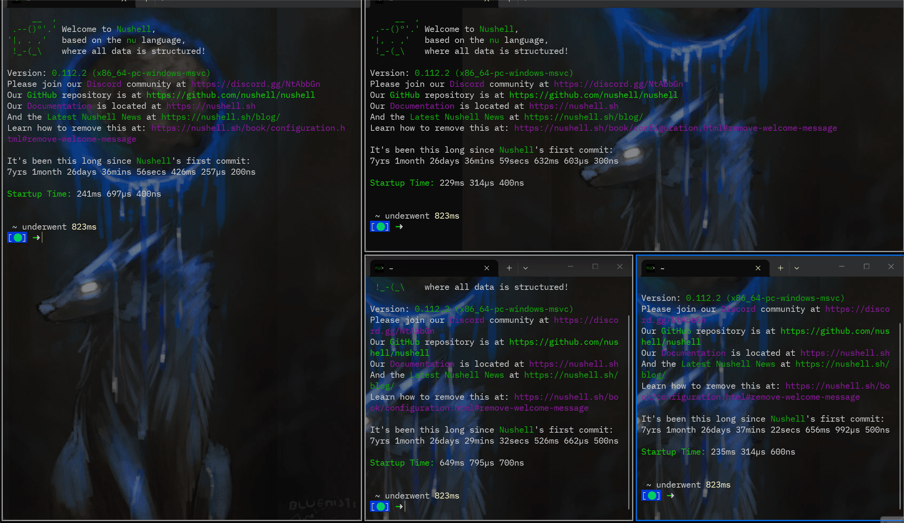
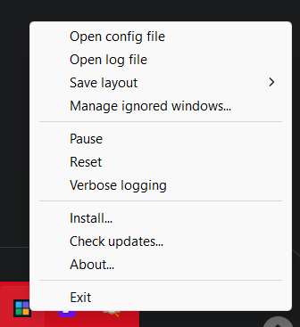

# win-tiler

`win-tiler` is a hotkey-driven tiling window manager for Microsoft Windows OS. It is most similar to [dwindle](https://wiki.hypr.land/Configuring/Layouts/Dwindle-Layout/) layout from hyprland.




## Features

- Supports both mouse and hot-key driven actions.
- Binary space partitioning layout engine for splitting, navigating, moving, and exchanging tiles.
- Multi-monitor support based on monitor work areas.
- Supports multiple desktops
- TOML configuration for hotkeys, ignore rules, gaps, loop timing, layouts, and visualization.
- Config hot-reload while supported runtime modes are active.
- Zen mode for focusing the selected tile within the current monitor cluster.
- Ignore filters for processes, window titles, process/title pairs, child windows, and small windows.
- Overlay rendering for the current layout and selection state.
- Per-user installer, uninstall integration, and startup registration.

## Quick Start

Download the latest from releases page and then run the executable:

```text
win-tiler.exe
```

You will start using win-tiler directly. Check out the tray icon for more options:



You can do a per-user installation and by using the Install option. The app can be uninstalled from the add/remove programs system setting in Windows.

## How To

Default shortcuts use `super` for the Windows key. Keyboard bindings can be changed in the
configuration file.

### Core Tiling Actions

| Action | Default input | What it does |
| --- | --- | --- |
| `NavigateLeft` | `super+shift+h` | Select the nearest tiled window to the left. |
| `NavigateDown` | `super+shift+j` | Select the nearest tiled window below. |
| `NavigateUp` | `super+shift+k` | Select the nearest tiled window above. |
| `NavigateRight` | `super+shift+l` | Select the nearest tiled window to the right. |
| `ToggleSplit` | `super+shift+y` | Toggle the selected tile's parent split between vertical and horizontal. |
| `CycleSplitMode` | `super+shift+;` | Cycle the split mode used for new splits: dwindle, vertical, then horizontal. |
| `StoreCell` | `super+shift+[` | Store the selected tile as the source for a later exchange or move. |
| `ClearStored` | `super+shift+]` | Clear the stored tile. |
| `Exchange` | `super+shift+,` | Swap the stored tile with the selected tile. |
| `Move` | `super+shift+.` | Move the stored tile into the selected tile's position. |
| `SplitIncrease` | `super+shift+pageup` | Give the selected tile more space in its parent split. |
| `SplitDecrease` | `super+shift+pagedown` | Give the selected tile less space in its parent split. |
| `ExchangeSiblings` | `super+shift+e` | Swap the selected tile with its sibling in the same parent split. |
| `ToggleZen` | `super+shift+'` | Toggle zen mode for the selected tile. |
| `ResetSplitRatio` | `super+shift+home` | Reset the selected tile's parent split to 50/50. |
| `TogglePause` | `super+shift+\` or tray menu | Pause or resume automatic tiling. |
| `DumpWindowManagement` | `super+shift+d` | Write the current window management state to the log. |
| `RestartSystem` | `super+shift+r` or tray menu `Reset` | Rebuild tiling state from the current monitors and windows. |
| `ToggleFloating` | `super+shift+f` | Temporarily remove the selected or foreground window from tiling for this session; run it again to tile that window again. |
| `ToggleVerboseLogging` | `super+shift+v` or tray menu | Toggle verbose runtime logging. |
| `Exit` | `super+shift+escape` or tray menu | Exit `win-tiler`. |

### Mouse Actions

| Action | Mouse input | What it does |
| --- | --- | --- |
| Select a tile | Move the cursor over a tiled window. | Makes that tile the selected tile for hotkey actions. |
| Resize a split | Resize a tiled window with the normal Windows resize border and release the mouse. | Updates the matching split ratio to preserve the new size. |
| Drag/drop a window | Drag a tiled window and drop it over another tile. | Uses `loop.mouse_drag_drop`: by default, plain drag/drop exchanges windows. Hold `Ctrl` or use right-button drag/drop to perform the other action, which inserts the dragged window as a split. |
| Toggle zen by maximizing | Maximize a tiled window with the title-bar button or a Windows maximize shortcut. | When `toggle_zen_on_window_maximize` is enabled, toggles zen mode for that window. |

### Tray And Dialog Actions

Right-click the `win-tiler` notification-area icon to open the tray menu.

| Action | Mouse input | What it does |
| --- | --- | --- |
| Open config file | Tray menu `Open config file`. | Opens the active TOML configuration file, when one is active. |
| Open log file | Tray menu `Open log file`. | Opens the active log file. |
| Save layout | Tray menu `Save layout`, then choose one monitor or `Save All`. | Writes the current monitor layout rules to the active config. A monitor needs at least two tiled windows. |
| Manage ignored windows | Tray menu `Manage ignored windows...`. | Opens a dialog for adding or removing ignore rules. Select a row, then use `Add rule...` or `Remove rule...`; the dialog also has `Refresh`, `Copy details`, `Open config`, and `Close`. |
| Pause or unpause | Tray menu `Pause` or `Unpause`. | Same as `TogglePause`. |
| Reset | Tray menu `Reset`. | Same as `RestartSystem`. |
| Verbose logging | Tray menu `Verbose logging`. | Same as `ToggleVerboseLogging`; the menu item is checked while verbose logging is active. |
| Install or uninstall | Tray menu `Install...`. | Opens the installer dialog. From there you can install, uninstall, apply Start Menu or auto-start options, or close the dialog. |
| Check updates | Tray menu `Check updates...`. | Checks the installed app for an available update. |
| About | Tray menu `About...`. | Shows the app version and repository link. |
| Exit | Tray menu `Exit`. | Exits `win-tiler`. |

## Configuration

`win-tiler` reads TOML configuration from `--config <filepath>` or, for runtime commands such as
`loop` and `track-windows`, from `win-tiler.toml` next to the executable when that file exists.

Every configuration field is optional. Missing values fall back to built-in defaults. Keyboard
bindings merge with defaults when an action is omitted. Ignore lists can merge with or replace the
built-in defaults through the `merge_*_with_defaults` flags.

See [docs/configuration.md](docs/configuration.md) for the full configuration reference, default
generated config, layout rule examples, and monitor profile examples.
