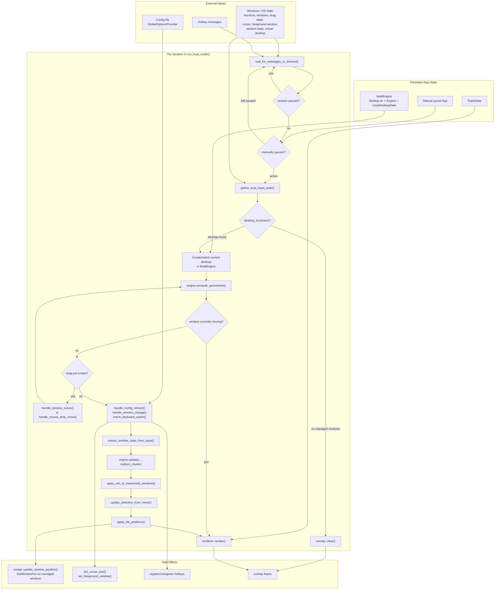

# `src/loop.cpp` Main Loop Data Flow

This document explains how `run_loop_mode()` in `src/loop.cpp` gathers state, mutates the tiling model, pushes layout changes back into Windows, and renders the overlay.

## Purpose

`run_loop_mode()` is the runtime coordinator for the real application mode. It sits between:

- Windows input/state collection in `winapi`
- Tiling state in `Engine` and `ctrl::System`
- Per-virtual-desktop state in `MultiEngine`
- Visual feedback in `renderer` and `overlay`

The loop is not only a render loop. It is also the synchronization point between external OS state and the internal tiling model.

## Key Runtime Data

- `GlobalOptionsProvider provider`
  Holds live configuration and supports hot reload.
- `MultiEngine<LoopDesktopData, std::string> multi_engine`
  Stores a separate `Engine` per virtual desktop, keyed by desktop GUID string.
- `Engine::system`
  The in-memory tiling model: clusters, binary split trees, selection, zen/fullscreen flags.
- `std::vector<std::vector<ctrl::Rect>> geometries`
  Per-frame computed rectangles for every cluster/cell. This is the derived layout used by later stages.
- `winapi::LoopInputState input_state`
  Snapshot of current Windows-side input and window state for the frame.
- `ToastState toast`
  Short-lived UI messages shown through the overlay.
- `bool is_manually_paused`
  Loop-local pause gate toggled by a hotkey.
- `LoopDesktopData::has_completed_initial_tile_pass`
  Per-desktop guard used by auto-zen so the first sync pass does not immediately toggle zen on startup.

## Data Flow Diagram

## Main Loop Walkthrough

### 1. Setup before the loop

Before entering `while (true)`, `run_loop_mode()` builds the long-lived environment:

- Reads current monitor layout.
- Creates a `MultiEngine` so each Windows virtual desktop can keep its own tiling state.
- Registers hotkeys, drag/resize hooks, session/power notifications, and virtual desktop detection.
- Initializes the overlay renderer.
- Creates the toast state and the manual pause flag.

At this point nothing has been tiled yet for the current frame. The actual synchronization begins inside the loop.

### 2. Wait phase and pause gates

Each iteration starts with `winapi::wait_for_messages_or_timeout(options.loopOptions.intervalMs)`.

That call gives the loop two wake-up sources:

- timeout-based polling
- Windows messages such as hotkeys and notifications

After waking up, the loop applies two early gates:

1. Session pause gate
   If the session is locked, suspended, or the display is off, the loop blocks in `wait_for_session_active()` and restarts the iteration after resume.
2. Manual pause gate
   If the user toggled pause, the loop only listens for the unpause hotkey and otherwise skips all tiling work.

These gates prevent unnecessary state mutation when interaction with the desktop is not meaningful.

### 3. Gather one consolidated OS snapshot

`winapi::gather_loop_input_state()` builds a single frame snapshot:

- monitor list
- windows per monitor
- fullscreen/maximized flags per managed window
- drag/move state
- cursor position
- ctrl-key state
- foreground window
- virtual desktop id

This snapshot is the external input for the rest of the frame.

### 4. Select the correct per-desktop engine

The loop uses `input_state.desktop_id` to decide which engine instance should be active.

- If no managed window exists, there is no desktop id. The loop clears the overlay and skips the frame.
- If the desktop id is new, `multi_engine.create_desktop(...)` creates a fresh engine initialized from current monitors.
- If the active desktop changed, `multi_engine.switch_to(...)` swaps to the correct persistent engine state.

From this point on, the frame works only on the current desktop's `Engine`.

### 5. Compute derived layout geometry

`engine.compute_geometries(gap_h, gap_v, zen_pct)` converts the current tree model into rectangles.

This is a derived cache used by later phases for:

- hit testing
- hover selection
- cursor centering
- drag-drop target detection
- resize ratio updates
- actual tiling output
- overlay rendering

This explains why the loop recomputes `geometries` after any operation that can change tree structure or cell sizes.

### 6. Special drag handling path

There are two drag-related branches:

1. Window is currently being moved
   If `input_state.is_any_window_being_moved` is true, the loop does not retile. It only renders the overlay and ends the frame.

2. Drag just ended
   If `drag_info.move_ended` is true, the loop tries to interpret the completed drag:
   - `handle_window_resize(...)` treats it as a resize if the real window size differs from the expected cell size.
   - otherwise `handle_mouse_drop_move(...)` treats it as a move/swap drop operation.

After either operation, geometry is recomputed because the tree or split ratios may have changed.

### 7. Refresh configuration, monitors, and hotkey actions

The next phase mixes three independent control sources:

- `handle_config_refresh(...)`
  Reloads config, re-registers hotkeys, and updates toast duration.
- `handle_monitor_change(...)`
  Detects monitor topology changes and reinitializes the current engine from the new monitor set.
- `check_keyboard_action()`
  Drains one pending hotkey message and maps it to `HotkeyAction`.

Hotkey processing can mutate the engine through `engine.process_action(...)`, and some actions also trigger direct OS side effects:

- `Exit` breaks the loop
- `TogglePause` short-circuits the rest of the iteration
- navigation actions may call `set_foreground_window()` and `set_cursor_pos()`
- ratio-changing actions move the cursor to the updated selected cell center

### 8. Reconcile Windows state into the tiling model

After direct actions are handled, the loop rebuilds a simplified per-monitor window snapshot with `extract_window_state_from_input(...)` and passes it into:

`engine.update(current_state, redirect_cluster)`

This is the main reconciliation step between external reality and internal model:

- deleted windows are removed from trees
- new windows are inserted into a target cluster
- fullscreen flags are synchronized
- selection may move to newly added windows

`redirect_cluster` decides where new windows should land:

- first choice: empty cluster under the mouse
- second choice: currently selected cluster

### 9. Optional auto-zen transition

If enabled by config, `apply_zen_to_maximized_windows(...)` scans the current monitor windows and toggles zen mode for maximized managed windows.

Important detail:

- the first tile pass on a desktop is ignored using `has_completed_initial_tile_pass`

That avoids interpreting the startup state as a user action that should immediately trigger zen.

### 10. Selection polish, tiling, and rendering

The frame ends with three output stages:

1. Selection update
   If the model did not just change because of `engine.update(...)`, the loop may move selection to the cell currently under the mouse via `update_selection_from_hover(...)`.

2. Apply tile positions
   `apply_tile_positions(...)` converts geometry into `winapi::TileInfo` and calls `winapi::update_window_position(...)` for each managed leaf, unless the cluster is fullscreen.

3. Render overlay
   `renderer::render(...)` draws cell outlines, zen overlays, stored-cell highlights, and any toast message using the overlay subsystem.

## Why the Loop Looks Complex

The loop is doing four jobs at once:

1. Polling and reacting to OS events
2. Maintaining one tiling model per virtual desktop
3. Reconciling model state with live Windows state
4. Emitting both physical window moves and visual overlay output

That is why the loop contains repeated geometry recomputation and multiple early-exit branches. Each branch exists to preserve a stable contract:

- never retile while the user is actively dragging
- never mutate while the session is paused
- always operate on the correct virtual desktop state
- always render from geometry derived from the latest model

## Short Summary

The main loop in `src/loop.cpp` follows this pattern every frame:

1. Wait for messages or timeout.
2. Skip work if the session or user pause state says to wait.
3. Snapshot Windows state.
4. Select the correct virtual-desktop engine.
5. Derive geometry from the current tiling model.
6. Apply drag, config, monitor, and hotkey mutations.
7. Reconcile live windows back into the model.
8. Push updated geometry back out to real windows.
9. Render the overlay.

The most important design point is that `Engine::system` is the source of truth, while `geometries` is the per-frame derived view used to bridge between model logic, OS side effects, and rendering.
